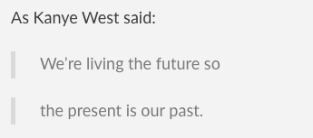

# Markdown

Markdown is a way to style text on the web. You control the display of the document; formating words as bold or italic, adding images, and creating lists.

+++

## Headers

```markdown
# This is an <h1> tag

## This is an <h2> tag

###### This is an <h6> tag
```

## Emphasis

```markdown
_This text will be italic_
_This will also be italic_
**This text will be bold**
**This will also be bold**
_You **can** combine them_
```

+++

## Lists

Unordered

```markdown
- Item 1
- Item 2
  - Item 2a
  - Item 2b
```

Ordered

```markdown
1. Item 1
2. Item 2
3. Item 3
   - Item 3a
   - Item 3b
```

+++

## Images

```markdown


Format: 
```

## Links

```markdown
http://github.com - automatic!
[Github](http://github.com)
```

+++

## Blockquotes

```markdown
As Kanye West said:

> We're living the future so
> the present is our past.
```


